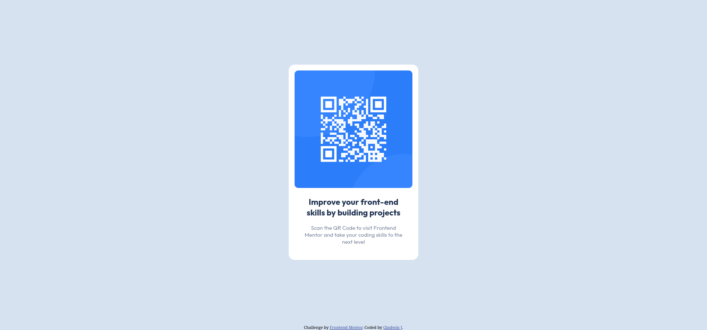

# Frontend Mentor - QR code component solution

This is a solution to the [QR code component challenge on Frontend Mentor](https://www.frontendmentor.io/challenges/qr-code-component-iux_sIO_H). Frontend Mentor challenges help you improve your coding skills by building realistic projects. 

## Table of contents

- [Overview](#overview)
  - [Screenshot](#screenshot)
  - [Links](#links)
- [My process](#my-process)
  - [Built with](#built-with)
  - [Continued development](#continued-development)
  - [Useful resources](#useful-resources)
- [Author](#author)

## Overview

### Screenshot

### Links

- Solution URL: [Add solution URL here](https://github.com/JGladwin/qr-code-component)
- Live Site URL: [Add live site URL here](https://your-live-site-url.com)

## My process

### Built with

- Semantic HTML5 markup
- CSS custom variables

### Continued development

I want to make it pixel perfect but don't know how. So, that will be put on hold till I can find how to do it.

### Useful resources

- [HTML section elements are a lie (sort of) | Youtube](https://youtu.be/ULdkpU51hTQ?si=NgEPNr4m_L44usJd) - Helped me realize how to write a section properly
- [CSS Custom Properties | Youtube](https://youtube.com/playlist?list=PL4-IK0AVhVjOT2KBB5TSbD77OmfHvtqUi&si=gCIGDwpqpodz59JW) - Familiarized myself with CSS custom variables
- [@font-face | MDN Web Docs](https://developer.mozilla.org/en-US/docs/Web/CSS/@font-face) - Using custom fonts

## Author

- Frontend Mentor - [@JGladwin](https://www.frontendmentor.io/profile/JGladwin)
